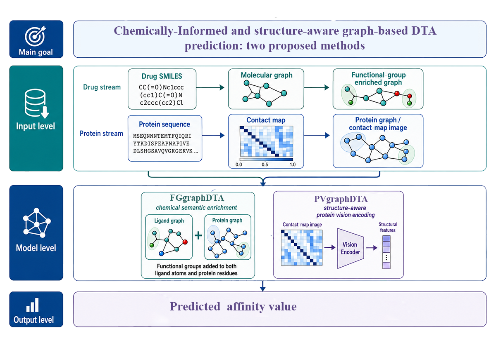
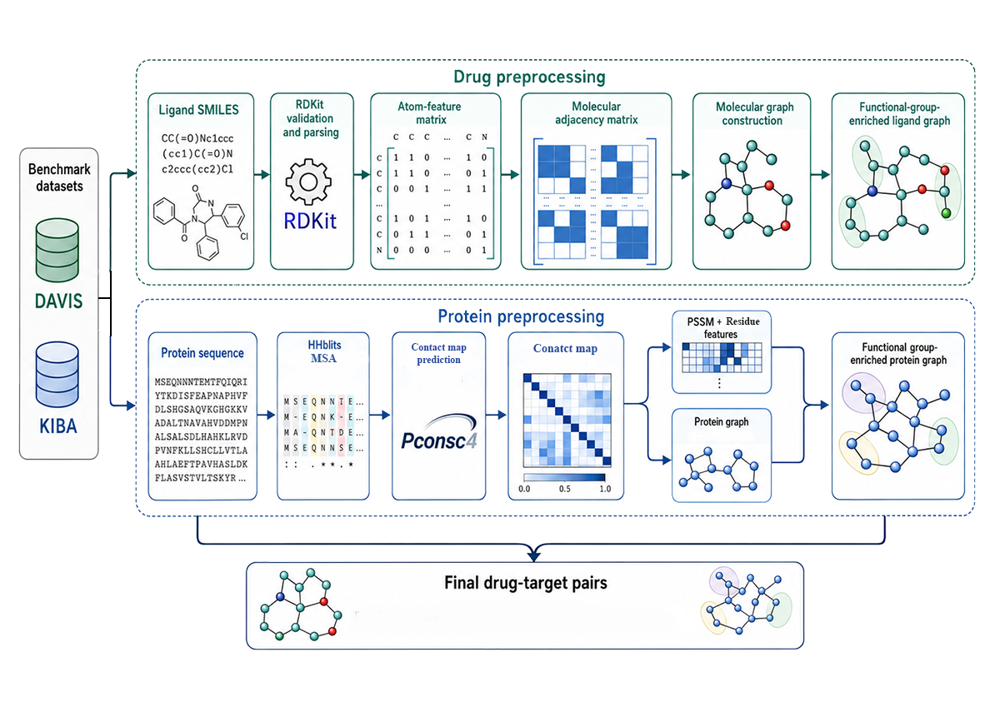

# FGgraphDTA and PVgraphDTA

Two graph-based methods for drug–target binding affinity prediction, combining
molecular chemistry with protein structural information.

## Method overview

**Figure 1.** The two methods use complementary representations of drug–target
pairs. **FGgraphDTA** enriches ligand atoms and protein residues with
SMARTS-based functional-group features, then combines their graph embeddings
to predict affinity. **PVgraphDTA** combines ligand and protein graph embeddings
with a CNN-encoded protein contact-map image. An autoencoder-derived latent
vector gates the visual representation, while an InfoNCE objective encourages
alignment between the three representations during training.

## Drug and protein preprocessing

**Figure 2.** Drug SMILES are parsed with RDKit to construct atom features and
bond connectivity; functional-group indicators enrich the ligand graph.
Protein sequences pass through HHblits multiple-sequence alignment and PconsC4
contact prediction. Alignment-derived residue profiles and physicochemical
features describe the protein nodes, while predicted contacts define graph
edges. Functional-group features enrich the protein graph for FGgraphDTA;
contact-map images provide the additional visual input for PVgraphDTA.

The repository also includes functional-group and model ablations, cold-target
evaluation, sensitivity studies, and paired statistical analysis.

For implementation and execution details, see the [workflow guide](docs/WORKFLOW_GUIDE.md).
